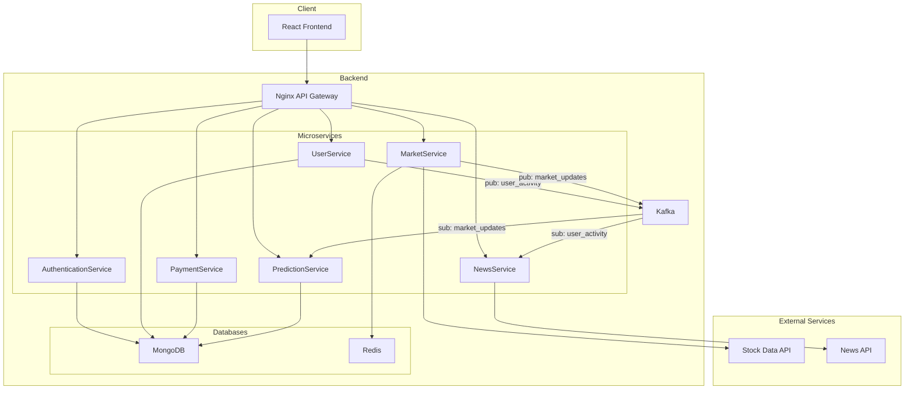
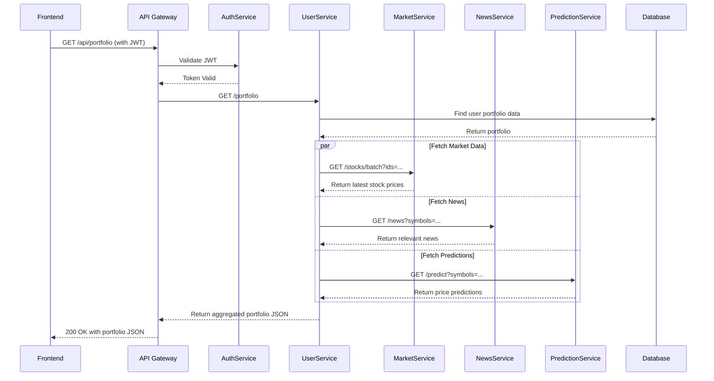

# Stock-Smith Architecture

## 1. Overview

The Stock-Smith platform is built on a microservices architecture to ensure scalability, modularity, and independent service management. This design allows different components of the application to be developed, deployed, and scaled independently. A React-based frontend communicates with the backend services through an Nginx API gateway, which routes requests to the appropriate microservice. This separation of concerns enhances maintainability and allows for technology diversity across services, such as using Node.js for I/O-intensive tasks and Python for machine learning computations.

## 2. High-Level Architecture Diagram

## 3. Microservices Description

### AuthenticationService
- **Tech Stack:** Node.js, Express, MongoDB
- **Responsibilities:**
  - User registration and login.
  - JWT (JSON Web Token) generation and validation for securing APIs.
- **Dependencies:** `UserService`, `MongoDB`

### UserService
- **Tech Stack:** Node.js, Express, MongoDB
- **Responsibilities:**
  - Manages user profiles (create, read, update, delete).
  - Handles user portfolio data, including stocks, transactions, and watchlists.
- **Dependencies:** `MongoDB`

### MarketService
- **Tech Stack:** Node.js, Express, Redis
- **Responsibilities:**
  - Fetches real-time and historical stock data from external APIs.
  - Caches frequently requested market data in Redis to reduce latency and API costs.
- **Dependencies:** `Redis`, External Stock Data API

### NewsService
- **Tech Stack:** Node.js, Express
- **Responsibilities:**
  - Aggregates financial news from various external sources.
  - Provides endpoints to search and retrieve news articles.
- **Dependencies:** External News API

### PredictionService
- **Tech Stack:** Python, Flask/FastAPI, Scikit-learn
- **Responsibilities:**
  - Provides stock price predictions using a trained machine learning model.
  - Exposes an API endpoint to get predictions for a given stock.
- **Dependencies:** `MongoDB` (for historical data to train on)

### PaymentService
- **Tech Stack:** Node.js, Express, MongoDB
- **Responsibilities:**
  - Manages user subscriptions and payment information.
  - Integrates with a payment gateway (e.g., Stripe, PayPal - to be implemented).
- **Dependencies:** `UserService`, `MongoDB`

## 4. Data Flow

Here is an example of a data flow for a user fetching their portfolio, including interactions with other services:

## 5. Database Schema (High-level)

The primary database is MongoDB, a NoSQL database that provides flexibility for storing user and application data across all services.

**Key Collections (MongoDB):**

-   **users (from AuthenticationService):**
    -   `_id`
    -   `name`
    -   `email`
    -   `password` (hashed)
    -   `isMfaActive`
    -   `mfaSecret`
    -   `resetPasswordToken`
    -   `resetPasswordExpire`

-   **holdings (from UserService):**
    -   `_id`
    -   `userId` (reference to users)
    -   `holdings` (array of stock objects)
        -   `ticker`
        -   `investedPrice`
        -   `investedQuantity`
        -   `currentQuantity`
        -   `purchaseDate`

-   **watchlists (from UserService):**
    -   `_id`
    -   `userId` (reference to users)
    -   `name`
    -   `description`
    -   `stocksSymbols` (array of strings)

-   **usersubscriptions (from UserService):**
    -   `_id`
    -   `userId` (reference to users)
    -   `subscriptionType` ('free', 'premium')
    -   `subscription` (object)
        -   `status` ('active', 'inactive')
        -   `startDate`
        -   `endDate`
        -   `currentPlanId` (reference to subscriptionplans)

-   **payments (from PaymentService):**
    -   `_id`
    -   `userId` (reference to users)
    -   `orderId`
    -   `paymentId`
    -   `planId` (reference to subscriptionplans)
    -   `amount`
    -   `status` ('pending', 'success', 'failed')
    -   `paymentDate`

-   **subscriptionplans (from PaymentService):**
    -   `_id`
    -   `name`
    -   `type` ('free', 'premium')
    -   `price` (object)
        - `amount`
        - `currency`
        - `billingCycle` ('monthly', 'annually')
    -   `features` (object)
        - `dailyPredictionLimit`
    -   `isActive`

-   **userpredictions (from PredictionService):**
    -   `_id`
    -   `user_id` (reference to users)
    -   `prediction_usage` (object)
        -   `daily_usage`
        -   `last_reset_date`
    -   `subscription_details` (object)
        -   `daily_limit`
        -   `subscription_plan_id` (reference to subscriptionplans)
        -   `subscription_plan_type`
        -   `start_date`
        -   `end_date`

## 6. Tech Stack Summary

-   **Frontend:** React, Vite, TypeScript, Tailwind CSS
-   **Backend Microservices:** Node.js, Express
-   **Machine Learning Service:** Python, Flask
-   **API Gateway:** Nginx
-   **Database:** MongoDB (Primary), Redis (Caching)
-   **Containerization & Orchestration:** Docker, Docker Compose
